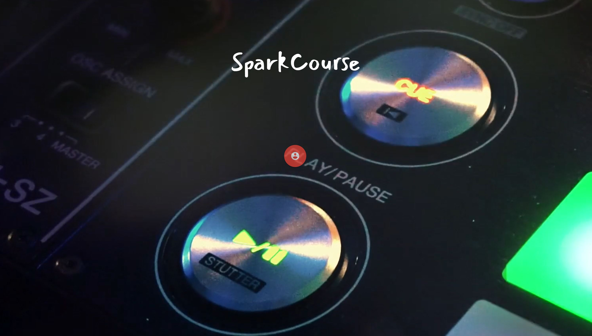

# SparkCourse
This app will spark up a free course built from resources found through reddit, youtube, and a few extra websites

### Technologies Used
#### Back-end
* Cheerio
    ** For scrapping course material (articles and videos)
* Nightmare
    ** Assisted cheerio in scrapping certain sources 
* Express/Express-Session
* mysql
    **Database 
* Sequelize 
    **ORM
* Passport
    ** User Authentication 

#### Front-End
* Random-words  
    ** Used to generate fun and random course titles 
* Sheperd
    ** A popup display to guide users through course create 
* Materialize 
    ** For quick and easy styling 
* iziModal
    ** Unique modal event handler 

## Current Issues
* There is a community known issue regarding the usage of nightmare/electron and website hosting servies (heroku, google app engine, etc.). Nightmare uses a browser to perform a search. There is no browser avaiable when hosting on a server. There is the option to generate a 'fake' browser by initializing a headless-browser but the methodology is a bit out of my scope at the moment. 

[Check the link to view the app in action!](https://vimeo.com/user104783796/review/370726605/338d0a7ca8)

### Snapshot

